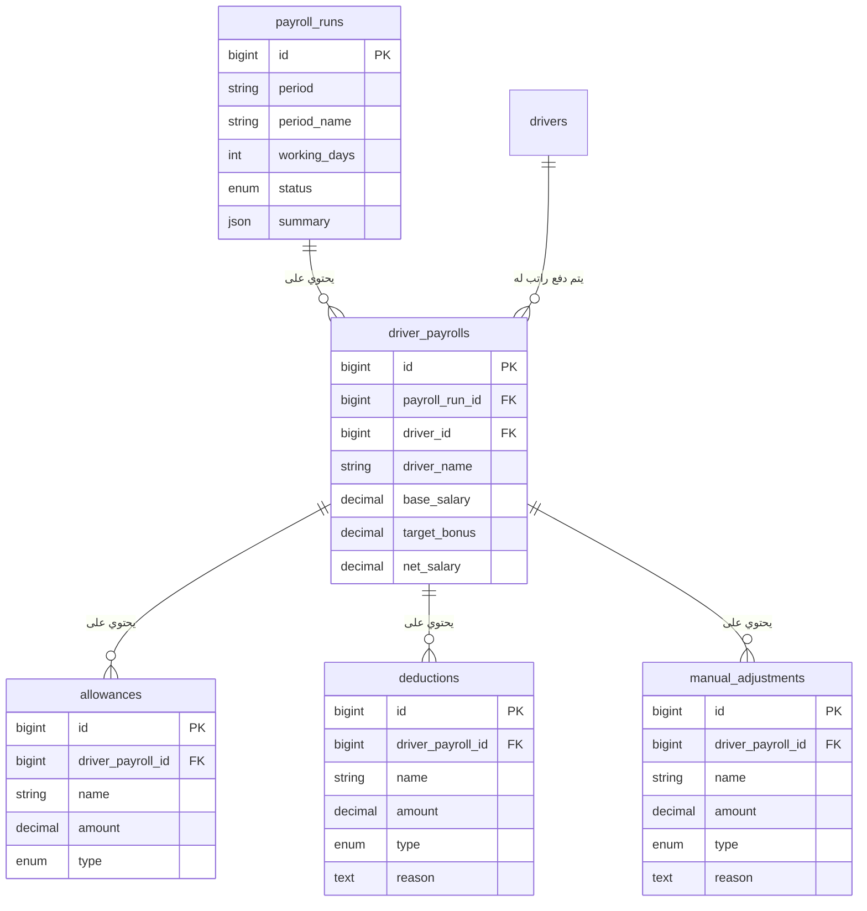

# نظام الرواتب - Payroll System

## نظرة عامة

نظام الرواتب هو نظام متكامل لإدارة رواتب السائقين في الشركة. يتيح النظام إنشاء مسيرات رواتب شهرية مع إمكانية إضافة بدلات وخصومات وتعديلات يدوية.

## الميزات الرئيسية

### ✅ الميزات الأساسية
- إنشاء مسيرات رواتب شهرية
- إدارة رواتب السائقين الفردية
- إضافة بدلات متنوعة (شهرية، يومية، لمرة واحدة)
- إضافة خصومات (ثابتة، نسبية، يومية)
- تعديلات يدوية (إضافات أو خصومات)
- حساب تلقائي للأرباح والخصومات وصافي الراتب
- تتبع حالة الدفع لكل سائق

### 🔄 حالات المسير
- **draft**: مسودة (قابل للتعديل)
- **approved**: معتمد (جاهز للدفع)
- **paid**: مدفوع
- **cancelled**: ملغي

### 💰 أنواع البدلات
- **monthly**: بدل شهري (مثل بدل إنترنت)
- **daily**: بدل يومي (مثل بدل طعام)
- **one_time**: بدل لمرة واحدة

### 📉 أنواع الخصومات
- **fixed**: خصم ثابت (مبلغ محدد)
- **percentage**: خصم نسبي (نسبة مئوية)
- **daily**: خصم يومي (مثل خصم غياب)

### ✏️ أنواع التعديلات اليدوية
- **addition**: إضافة (مكافأة إضافية)
- **subtraction**: خصم (خصم خاص)

## هيكل قاعدة البيانات

### الجداول الرئيسية

#### 1. `payroll_runs` - مسيرات الرواتب
```sql
- id: المعرف الفريد
- period: فترة الراتب (مثال: 2025-08)
- period_name: اسم الفترة (مثال: رواتب شهر أغسطس 2025)
- working_days: عدد أيام العمل
- status: حالة المسير
- summary: إجماليات المسير (JSON)
```

#### 2. `driver_payrolls` - رواتب السائقين
```sql
- id: المعرف الفريد
- payroll_run_id: معرف مسير الرواتب
- driver_id: معرف السائق
- driver_name: اسم السائق
- base_salary: الراتب الأساسي
- target_bonus: مكافأة التارجت
- working_days_actual: أيام العمل الفعلية
- absence_days: أيام الغياب
- overtime_hours: ساعات العمل الإضافي
- total_earnings: إجمالي الأرباح
- total_deductions: إجمالي الخصومات
- net_salary: صافي الراتب
- payment_status: حالة الدفع
- payment_date: تاريخ الدفع
```

#### 3. `allowances` - البدلات
```sql
- id: المعرف الفريد
- driver_payroll_id: معرف راتب السائق
- name: اسم البدل
- amount: مبلغ البدل
- type: نوع البدل
```

#### 4. `deductions` - الخصومات
```sql
- id: المعرف الفريد
- driver_payroll_id: معرف راتب السائق
- name: اسم الخصم
- amount: مبلغ الخصم
- type: نوع الخصم
- reason: سبب الخصم
```

#### 5. `manual_adjustments` - التعديلات اليدوية
```sql
- id: المعرف الفريد
- driver_payroll_id: معرف راتب السائق
- name: اسم التعديل
- amount: مبلغ التعديل
- type: نوع التعديل
- reason: سبب التعديل
```

### العلاقات



## API Endpoints

### مسيرات الرواتب

#### 1. جلب جميع مسيرات الرواتب
```http
GET /api/v1/company/tables/payroll_runs
```

**Query Parameters:**
- `status`: تصفية حسب الحالة
- `period`: تصفية حسب الفترة
- `page`: رقم الصفحة

**Response:**
```json
{
  "status": true,
  "code": 200,
  "message": "تم جلب مسيرات الرواتب بنجاح",
  "payload": {
    "current_page": 1,
    "data": [...],
    "per_page": 15,
    "total": 25
  }
}
```

#### 2. إنشاء مسير رواتب جديد
```http
POST /api/v1/company/tables/payroll_runs
```

**Request Body:**
```json
{
  "period": "2025-01",
  "period_name": "رواتب شهر يناير 2025",
  "working_days": 26,
  "status": "draft",
  "driver_payrolls": [
    {
      "driver_id": 1,
      "driver_name": "أحمد محمد",
      "base_salary": 3000.00,
      "target_bonus": 500.00,
      "working_days_actual": 26,
      "allowances": [
        {
          "name": "بدل إنترنت شهري",
          "amount": 100.00,
          "type": "monthly"
        }
      ],
      "deductions": [],
      "manual_adjustments": []
    }
  ]
}
```

#### 3. جلب مسير رواتب محدد
```http
GET /api/v1/company/tables/payroll_runs/{id}
```

#### 4. تحديث حالة مسير الرواتب
```http
PUT /api/v1/company/tables/payroll_runs/{id}
```

**Request Body:**
```json
{
  "status": "approved"
}
```

#### 5. حذف مسير رواتب
```http
DELETE /api/v1/company/tables/payroll_runs/{id}
```

#### 6. إحصائيات الرواتب
```http
GET /api/v1/company/tables/payroll_runs/statistics
```

**Response:**
```json
{
  "status": true,
  "code": 200,
  "message": "تم جلب إحصائيات الرواتب بنجاح",
  "payload": {
    "total_payroll_runs": 15,
    "total_drivers_paid": 120,
    "total_amount_paid": 450000.00,
    "pending_payments": 25,
    "pending_amount": 95000.00,
    "monthly_stats": [...]
  }
}
```

## استخدام النظام

### 1. إنشاء مسير رواتب جديد

```php
// في Controller
public function store(PayrollRunRequest $request)
{
    $validatedData = $request->validated();
    
    // إنشاء مسير الرواتب
    $payrollRun = PayrollRun::create([
        'period' => $validatedData['period'],
        'period_name' => $validatedData['period_name'],
        'working_days' => $validatedData['working_days'],
        'status' => 'draft'
    ]);
    
    // إنشاء رواتب السائقين
    foreach ($validatedData['driver_payrolls'] as $driverData) {
        $driverPayroll = $payrollRun->driverPayrolls()->create([
            'driver_id' => $driverData['driver_id'],
            'driver_name' => $driverData['driver_name'],
            'base_salary' => $driverData['base_salary'],
            'target_bonus' => $driverData['target_bonus'] ?? 0
        ]);
        
        // إضافة البدلات
        if (!empty($driverData['allowances'])) {
            $driverPayroll->allowances()->createMany($driverData['allowances']);
        }
        
        // إضافة الخصومات
        if (!empty($driverData['deductions'])) {
            $driverPayroll->deductions()->createMany($driverData['deductions']);
        }
    }
}
```

### 2. حساب صافي الراتب

```php
// في Model DriverPayroll
public function calculateNetSalary(): float
{
    $totalEarnings = $this->calculateTotalEarnings();
    $totalDeductions = $this->calculateTotalDeductions();
    
    return $totalEarnings - $totalDeductions;
}

public function calculateTotalEarnings(): float
{
    $baseSalary = $this->base_salary ?? 0;
    $targetBonus = $this->target_bonus ?? 0;
    $allowancesTotal = $this->allowances()->sum('amount');
    
    return $baseSalary + $targetBonus + $allowancesTotal;
}
```

### 3. جلب مسير رواتب مع العلاقات

```php
$payrollRun = PayrollRun::with([
    'driverPayrolls.driver',
    'driverPayrolls.allowances',
    'driverPayrolls.deductions',
    'driverPayrolls.manualAdjustments'
])->find($id);
```

## التحقق من صحة البيانات

### PayrollRunRequest

```php
public function rules(): array
{
    return [
        'period' => 'required|string|max:10',
        'period_name' => 'required|string|max:255',
        'working_days' => 'required|integer|min:20|max:31',
        'status' => 'required|in:draft,approved,paid,cancelled',
        'driver_payrolls' => 'required|array|min:1',
        'driver_payrolls.*.driver_id' => 'required|exists:drivers,id',
        'driver_payrolls.*.base_salary' => 'required|numeric|min:0',
        'driver_payrolls.*.net_salary' => 'required|numeric|min:0'
    ];
}
```

## الأمان والصلاحيات

### 1. التحقق من الصلاحيات
```php
public function authorize(): bool
{
    // يمكن إضافة منطق التحقق من الصلاحيات هنا
    return auth()->user()->can('manage_payroll');
}
```

### 2. حماية البيانات
- جميع العمليات تتم داخل transactions
- استخدام Form Requests للتحقق من صحة البيانات
- تسجيل جميع العمليات في logs

## المراقبة والتتبع

### 1. تسجيل العمليات
```php
Log::info('Payroll run created', [
    'payroll_run_id' => $payrollRun->id,
    'user_id' => auth()->id(),
    'period' => $payrollRun->period
]);
```

### 2. إحصائيات الأداء
- عدد مسيرات الرواتب المنشأة
- إجمالي المبالغ المدفوعة
- متوسط الرواتب
- توزيع الحالات

## استكشاف الأخطاء

### 1. مشاكل شائعة

#### خطأ في العلاقات
```bash
# تأكد من وجود جدول drivers
php artisan migrate:status

# إعادة تشغيل migrations
php artisan migrate:refresh
```

#### خطأ في البيانات
```bash
# فحص البيانات
php artisan tinker
>>> App\Models\PayrollRun::with('driverPayrolls')->first()
```

### 2. فحص قاعدة البيانات
```sql
-- فحص العلاقات
SELECT 
    pr.period,
    pr.period_name,
    COUNT(dp.id) as drivers_count,
    SUM(dp.net_salary) as total_salaries
FROM payroll_runs pr
LEFT JOIN driver_payrolls dp ON pr.id = dp.payroll_run_id
GROUP BY pr.id;

-- فحص البدلات
SELECT 
    dp.driver_name,
    a.name as allowance_name,
    a.amount
FROM driver_payrolls dp
JOIN allowances a ON dp.id = a.driver_payroll_id;
```

## التطوير المستقبلي

### 1. ميزات مقترحة
- تصدير PDF للرواتب
- إرسال إشعارات للدفع
- تكامل مع نظام البنوك
- تقارير متقدمة
- نظام الموافقات

### 2. تحسينات الأداء
- إضافة caching للاستعلامات المتكررة
- تحسين indexes
- استخدام queues للمعالجة

## الدعم والمساعدة

للمساعدة أو الاستفسارات حول نظام الرواتب، يرجى التواصل مع فريق التطوير.

---

**تاريخ الإنشاء**: يناير 2025  
**الإصدار**: 1.0  
**آخر تحديث**: يناير 2025
